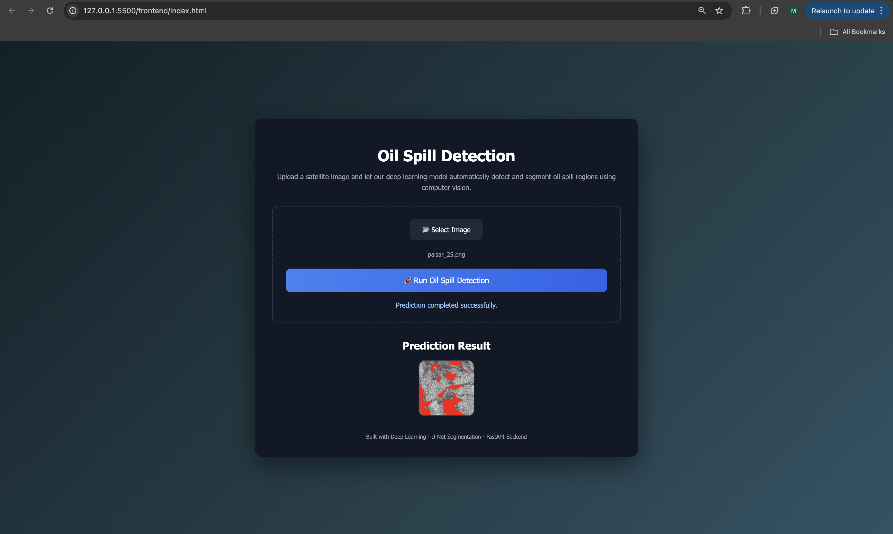

# Oil Spill Detection using Image Segmentation

## Overview
Oil spills pose serious environmental and economic risks to marine and coastal ecosystems.  
This project focuses on detecting oil spill regions from satellite imagery using deep learning–based image segmentation.

A **U-Net–style Convolutional Neural Network (CNN)** is used to perform pixel-wise classification, identifying oil spill areas in water bodies.

---

---

## Problem Statement
Given satellite images of water surfaces, automatically identify and segment regions affected by oil spills to support early detection, monitoring, and environmental response efforts.

---

## Dataset
The dataset consists of paired **image–mask samples**:

- **Images**: Satellite images of water bodies  
- **Masks**: Binary segmentation masks indicating oil spill regions  
- **Splits**: Training and validation sets  

### Dataset Structure
images/
├── train/
└── val/

masks/
├── train/
└── val/

**Note:**  
Due to repository size constraints, the full dataset is not included in this repository.  

---

## Project Workflow
1. Exploratory Data Analysis (EDA)
2. Image and mask visualization
3. Data preprocessing and normalization
4. Model building (U-Net architecture)
5. Training on real image–mask pairs
6. Prediction and qualitative evaluation
7. Model and result saving
8. Frontend & Backend for the model

## How to Run

### Clone Repo
git clone https://github.com/springboardmentor112r-Agri/Oil_Spill_Detection-.git

### Install Dependencies
pip install -r requirements.txt

### Run Backend
uvicorn backend.main:app --reload

### Run Frontend
frontend/index.html

---

## Future Improvements
- Train on larger and more diverse satellite datasets
- Apply transfer learning for improved generalization
- Optimize model performance and inference speed
- Integrate real-time satellite data pipelines

---

## Conclusion
This project demonstrates an **end-to-end deep learning pipeline** for oil spill detection, covering data exploration, preprocessing, model development, evaluation, and deployment.

The approach can be extended to real-world environmental monitoring and decision-support systems.

---

## Author
Mohit Rohda

