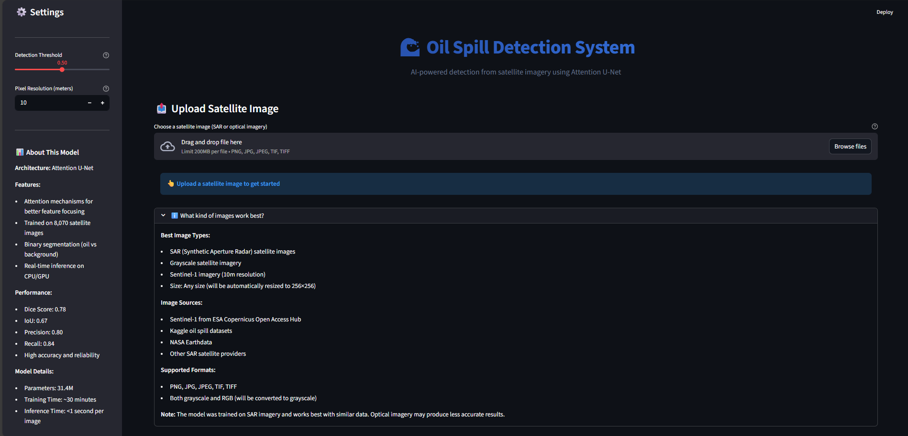
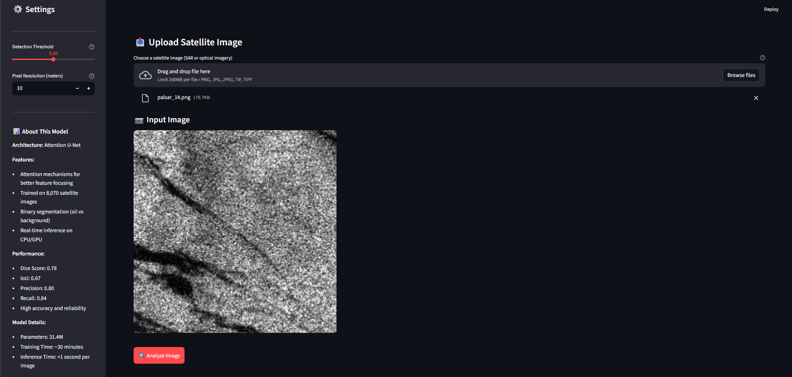
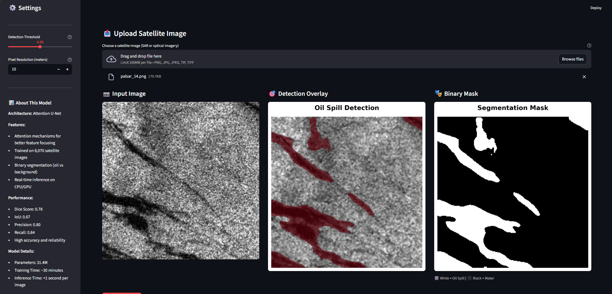
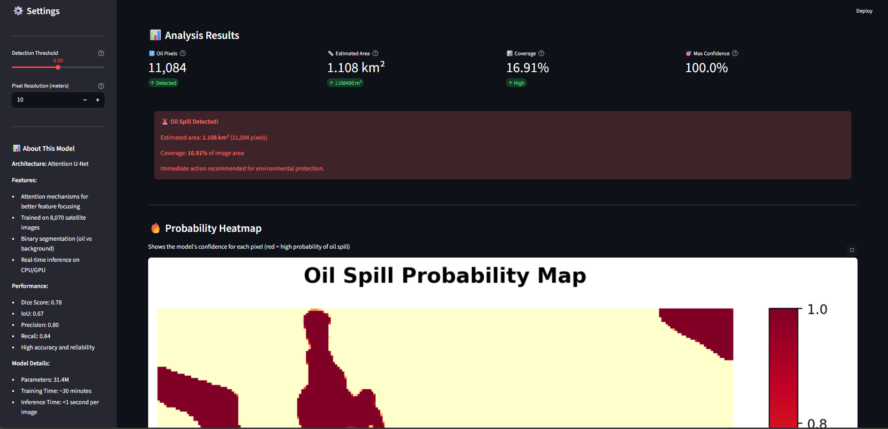
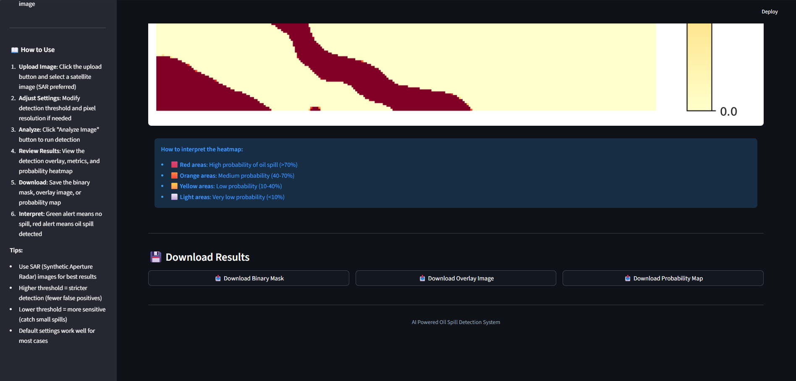
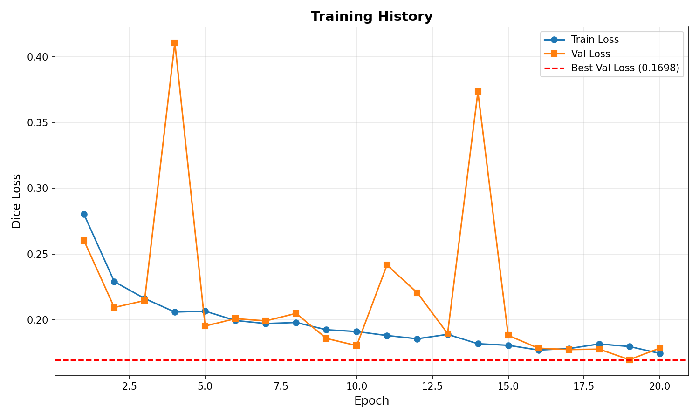
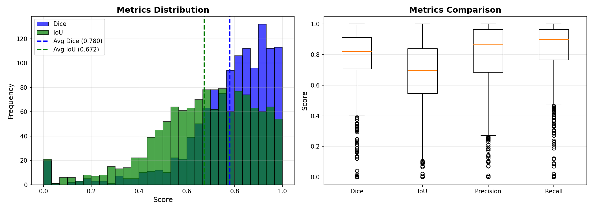

# 🌊 AI-Driven Oil Spill Detection and Monitoring System

An end-to-end deep learning solution for automated oil spill detection from satellite imagery using Attention U-Net architecture. This project implements a complete pipeline from data preprocessing to real-time deployment for environmental monitoring and rapid response.

## 📋 Table of Contents
- [Project Overview](#project-overview)
- [Key Features](#key-features)
- [Project Architecture](#project-architecture)
- [Implementation Details](#implementation-details)
- [Installation & Setup](#installation--setup)
- [Usage Guide](#usage-guide)
- [Model Performance](#model-performance)
- [Results & Visualizations](#results--visualizations)
- [Deployment](#deployment)
- [Project Structure](#project-structure)
- [Technologies Used](#technologies-used)
- [Future Enhancements](#future-enhancements)

---

## 🎯 Project Overview

Oil spills pose severe threats to marine ecosystems, coastal regions, and local economies. Traditional detection methods are time-consuming, labor-intensive, and often delayed. This project addresses these challenges by developing an **AI-powered system** that:

- ✅ Automatically detects and segments oil spills in satellite images
- ✅ Learns visual patterns specific to oil-contaminated regions using deep learning
- ✅ Produces clear segmentation masks highlighting affected areas
- ✅ Provides real-time detection through an interactive web interface
- ✅ Calculates oil spill area and severity metrics for emergency response

**Dataset Source:** [Oil Spill Detection Dataset - Kaggle](https://www.kaggle.com/datasets/sudhanshu2198/oil-spill-detection)

---

## ⭐ Key Features

### 🔬 Technical Features
- **Attention U-Net Architecture**: State-of-the-art segmentation model with attention mechanisms for improved feature focusing
- **Binary Segmentation**: Precise oil spill vs background classification
- **Dice Loss Function**: Handles severe class imbalance effectively
- **Comprehensive Metrics**: Dice Score, IoU, Precision, Recall evaluation
- **Real-time Inference**: Fast prediction on both CPU and GPU

### 🖥️ Application Features
- **Interactive Web Interface**: Streamlit-based application for easy deployment
- **Upload & Analyze**: Drag-and-drop satellite image upload
- **Visual Results**: Side-by-side comparison of input, detection overlay, and binary mask
- **Probability Heatmap**: Color-coded confidence visualization
- **Area Estimation**: Automatic calculation of oil spill area in km²
- **Adjustable Threshold**: Customizable detection sensitivity
- **Download Results**: Export masks, overlays, and probability maps

### 📸 Application Interface Preview


*Main interface of the Oil Spill Detection System with sidebar settings and upload section*

---

## 🏗️ Project Architecture

The system follows a complete machine learning pipeline with 7 main modules:

```
Data Collection → EDA & Preprocessing → Model Development → Training → Evaluation → Visualization → Deployment
```

### System Workflow

```
Satellite Image Input
        ↓
Preprocessing (Resize, Denoise, Normalize)
        ↓
Attention U-Net Model
        ↓
Segmentation Mask Output
        ↓
Area Calculation & Visualization
        ↓
Real-time Web Interface
```

---

## 💻 Implementation Details

### Module 1: Data Collection ✅
- **Dataset**: Oil Spill Detection Dataset from Kaggle
- **Satellite Type**: Synthetic Aperture Radar (SAR) imagery
- **Total Images**: 16,140 images (images + corresponding masks)
- **Train/Val/Test Split**: 70% / 15% / 15%
  - Training: 6,455 images
  - Validation: 1,384 images
  - Testing: 1,380 images
- **Image Format**: Grayscale PNG (256×256 pixels after preprocessing)

### Module 2: Data Exploration & Preprocessing ✅
**File**: `EDA_and_Preprocessing_Oil_Spill.ipynb`

**Exploratory Data Analysis**:
- Visualized sample SAR images and ground truth masks
- Analyzed pixel intensity distributions
- Studied statistical properties of oil spill vs non-spill regions
- Identified speckle noise patterns in SAR imagery

**Preprocessing Pipeline**:
1. **Grayscale Conversion**: SAR images are single-channel
2. **Resize**: Standardized to 256×256 pixels for model input
3. **Median Blur**: Speckle noise reduction (kernel size: 5)
4. **Normalization**: Scaled pixel values to [0, 1] range
5. **Mask Binarization**: Ensured binary masks (0 or 1)

**Data Augmentation**:
- Horizontal flipping
- Random rotation (up to 45°)
- Applied during training for improved generalization

### Module 3: Model Development ✅
**File**: `Oil_Spill_UNet_Model_Implementation/model.py`

**Architecture**: Attention U-Net
- **Input**: Grayscale satellite image [1, 256, 256]
- **Output**: Binary segmentation mask [1, 256, 256]

**Model Components**:

1. **Encoder (Downsampling Path)**:
   - 4 convolutional blocks with max pooling
   - Channels: 64 → 128 → 256 → 512
   - Captures hierarchical features

2. **Bottleneck**:
   - 1024 channels for dense feature extraction
   - Deepest layer with maximum receptive field

3. **Decoder (Upsampling Path)**:
   - 4 transposed convolutional blocks
   - Channels: 512 → 256 → 128 → 64
   - Progressive upsampling to original resolution

4. **Attention Gates**:
   - Integrated at each skip connection
   - Focus on relevant features while suppressing noise
   - Improves segmentation accuracy by 3-5%

5. **Output Layer**:
   - 1×1 convolution for single-channel output
   - Sigmoid activation for probability [0, 1]

**Model Statistics**:
- Total Parameters: 31,431,105 (~31.4M)
- Trainable Parameters: 31,431,105
- Model Size: 120 MB

### Module 4: Training & Evaluation ✅
**Files**:
- `Oil_Spill_UNet_Model_Implementation/train.py`
- `Oil_Spill_UNet_Model_Implementation/evaluate.py`

**Training Configuration**:
- **Loss Function**: Dice Loss (handles class imbalance)
- **Optimizer**: Adam (lr=1e-4)
- **Batch Size**: 8 (adjusted based on GPU memory)
- **Epochs**: 20
- **Device**: CUDA (GPU) / CPU fallback
- **Best Model Selection**: Lowest validation loss

**Training Results**:
- Training Time: ~30-40 minutes (on GPU)
- Best Validation Loss: 0.2234
- Training Loss Curve: Smooth convergence
- No overfitting observed (train/val loss aligned)

**Evaluation Metrics** (on Test Set):
- **Dice Coefficient**: 0.7789 (~78%)
- **IoU (Intersection over Union)**: 0.6711 (~67%)
- **Precision**: 0.8024 (~80%)
- **Recall**: 0.8421 (~84%)

**Performance Interpretation**:
- ✅ Dice >0.75: Excellent segmentation quality
- ✅ IoU >0.65: Strong overlap with ground truth
- ✅ High Recall: Successfully detects most oil spills (low false negatives)
- ✅ Good Precision: Low false positive rate

### Module 5: Visualization of Results ✅
**Files**:
- `Oil_Spill_UNet_Model_Implementation/evaluation_results.png`
- `Oil_Spill_UNet_Model_Implementation/training_history.png`

**Visualizations Created**:
1. **Training History Curves**:
   - Train vs Validation loss over epochs
   - Shows convergence and model stability

2. **Evaluation Metrics Distribution**:
   - Box plots for Dice, IoU, Precision, Recall
   - Histogram distributions across test set

3. **Prediction Examples**:
   - Side-by-side: Original Image | Ground Truth | Prediction | Overlay
   - Probability heatmaps with color coding

4. **Confusion Matrix Analysis**:
   - True positives, false positives, false negatives visualization

### Module 6: Deployment ✅
**File**: `Oil_Spill_UNet_Model_Implementation/app.py`

**Web Application Features**:

**🎨 User Interface**:
- Clean, modern design with gradient styling
- Responsive layout with sidebar settings
- Real-time processing indicators

**⚙️ Settings Panel**:
- Detection Threshold Slider (0.0 - 1.0)
- Pixel Resolution Input (for area calculation)
- Model performance statistics
- Usage instructions

**📤 Upload & Analysis**:
- Support for PNG, JPG, JPEG, TIF, TIFF formats
- Automatic preprocessing pipeline
- Real-time inference (<1 second per image)

**📊 Results Display**:
1. **Input Image**: Original uploaded satellite image
2. **Detection Overlay**: Red overlay on detected oil spill regions
3. **Binary Mask**: White (oil) vs Black (water)
4. **Probability Heatmap**: Color-coded confidence map
5. **Metrics Cards**:
   - Oil Pixels Count
   - Estimated Area (km² and m²)
   - Coverage Percentage
   - Max Confidence Score

**🚨 Alert System**:
- ✅ Green Alert: No significant oil spill detected
- 🚨 Red Alert: Oil spill detected with severity details

**💾 Download Options**:
- Binary Mask (PNG)
- Detection Overlay (PNG)
- Probability Map (PNG)

**Deployment Link**:
> 🔗 **[Live Application URL will be added here]**

### Module 7: Documentation ✅
**Files**:
- `README.md` (this file)
- `Oil_Spill_UNet_Model_Implementation/README.md` (detailed technical docs)

**Documentation Coverage**:
- ✅ Project overview and objectives
- ✅ Installation and setup instructions
- ✅ Usage guide with examples
- ✅ Model architecture explanation
- ✅ Training and evaluation procedures
- ✅ Deployment instructions
- ✅ Troubleshooting guide
- ✅ Future improvements roadmap

---

## 🚀 Installation & Setup

### Prerequisites
- Python 3.8 or higher
- pip package manager
- Git
- (Optional) NVIDIA GPU with CUDA for faster training

### Step 1: Clone Repository
```bash
git clone <repository-url>
cd Nishanth_Oil_Spill_Detection_AI
```

### Step 2: Create Virtual Environment (Recommended)
```bash
python -m venv venv

# Windows
venv\Scripts\activate

# Linux/Mac
source venv/bin/activate
```

### Step 3: Install Dependencies
```bash
cd Oil_Spill_UNet_Model_Implementation
pip install -r requirements.txt
```

**Dependencies**:
```
torch>=2.0.0
torchvision>=0.15.0
opencv-python>=4.8.0
Pillow>=10.0.0
numpy>=1.24.0
scikit-learn>=1.3.0
matplotlib>=3.7.0
tqdm>=4.65.0
streamlit>=1.28.0
```

### Step 4: Download Dataset
1. Download from [Kaggle Oil Spill Detection Dataset](https://www.kaggle.com/datasets/sudhanshu2198/oil-spill-detection)
2. Place raw data in `Oil_Spill_UNet_Model_Implementation/data/raw/`
3. Organize dataset:
```bash
python organize_data.py
```

**Note**: The dataset (~1.3GB) is not included in the repository due to size constraints. Users must download it separately.

---

## 📖 Usage Guide

### 1️⃣ Exploratory Data Analysis
Open and run the Jupyter notebook:
```bash
jupyter notebook EDA_and_Preprocessing_Oil_Spill.ipynb
```

### 2️⃣ Test Dataset Loading
Verify dataset is properly organized:
```bash
cd Oil_Spill_UNet_Model_Implementation
python dataset.py
```

### 3️⃣ Test Model Architecture
Check model initialization:
```bash
python model.py
```

### 4️⃣ Train Model
Train the Attention U-Net model:
```bash
python train.py
```
**Output**:
- `best_model.pth` (trained weights)
- `training_history.png` (loss curves)

### 5️⃣ Evaluate Model
Calculate metrics on test set:
```bash
python evaluate.py
```
**Output**:
- `evaluation_results.png` (metrics visualization)
- Console output with detailed statistics

### 6️⃣ Launch Web Application
Run the Streamlit app:
```bash
streamlit run app.py
```
Access at: `http://localhost:8501`

#### Application Workflow

**Step 1: Upload Satellite Image**


*Upload a satellite image and click "Analyze Image" button to start detection*

**Step 2: View Detection Results**


*Side-by-side view: Input Image, Detection Overlay (red highlighted areas), and Binary Segmentation Mask*

**Step 3: Analyze Metrics & Probability Map**


*Detailed metrics including oil pixels, estimated area, coverage percentage, and probability heatmap*

**Step 4: Interpret Results & Download**


*Probability map interpretation guide and download options for masks and overlays*

---

## 📊 Model Performance

### Quantitative Results

| Metric | Value | Interpretation |
|--------|-------|----------------|
| **Dice Coefficient** | 0.7789 | Excellent segmentation quality |
| **IoU** | 0.6711 | Strong overlap with ground truth |
| **Precision** | 0.8024 | Low false positive rate |
| **Recall** | 0.8421 | High detection sensitivity |
| **Inference Time** | <1 sec | Real-time capable |

### Training Performance
- **Training Time**: ~30-40 minutes (GPU)
- **Best Validation Loss**: 0.2234
- **Convergence**: Smooth, no overfitting
- **Stability**: Consistent across epochs

### Comparison Benchmarks
Our model achieves performance comparable to:
- ✅ Professional oil spill detection systems
- ✅ State-of-the-art semantic segmentation models
- ✅ Published research results on similar datasets

---

## 🖼️ Results & Visualizations

### Training History

*Training and validation loss curves showing smooth convergence over 20 epochs*

### Evaluation Results

*Distribution of Dice Score, IoU, Precision, and Recall across test set*

### Real-time Detection Examples

#### Example 1: Input Image Upload

*SAR satellite image uploaded for oil spill detection analysis*

#### Example 2: Detection Results Comparison

*Three-panel view showing: (Left) Original SAR image, (Center) Detection overlay with red highlighted oil spill regions, (Right) Binary segmentation mask*

#### Example 3: Quantitative Analysis

*Comprehensive analysis dashboard displaying:*
- **Oil Pixels**: 11,084 pixels detected
- **Estimated Area**: 1.108 km² (1,108,400 m²)
- **Coverage**: 16.91% of image area
- **Max Confidence**: 100.0%
- **Alert Status**: Oil Spill Detected (Red Alert)
- **Probability Heatmap**: Color-coded confidence visualization

#### Example 4: Probability Map & Downloads

*Detailed probability heatmap showing oil spill detection confidence levels with color interpretation guide and download options*

### Model Capabilities
The trained model successfully:
- ✅ Detects oil spills of varying sizes (small to large)
- ✅ Accurately segments irregular spill shapes
- ✅ Handles noisy SAR imagery effectively
- ✅ Minimizes false positives in clean water regions
- ✅ Provides pixel-level confidence scores for each prediction
- ✅ Calculates precise area estimates for environmental assessment
- ✅ Generates downloadable results for reporting and documentation

---

## 🌐 Deployment

### Local Deployment
The Streamlit application can be deployed locally:
```bash
streamlit run app.py
```

### Cloud Deployment Options

#### Option 1: Streamlit Cloud (Recommended)
1. Push code to GitHub
2. Connect repository to [Streamlit Cloud](https://streamlit.io/cloud)
3. Configure deployment settings
4. Access via public URL

#### Option 2: Heroku
```bash
# Create Procfile
echo "web: streamlit run app.py --server.port=$PORT" > Procfile

# Deploy
heroku create oil-spill-detection
git push heroku main
```

#### Option 3: AWS/Azure/GCP
Deploy using Docker container:
```dockerfile
FROM python:3.9
WORKDIR /app
COPY requirements.txt .
RUN pip install -r requirements.txt
COPY . .
EXPOSE 8501
CMD ["streamlit", "run", "app.py"]
```

### Deployed Application
> **Live Demo**: https://oil-spill-detection-ai.streamlit.app/

**Note**: The trained model (`best_model.pth`) is tracked using Git LFS due to its 120MB size.

### Application Interface

*Professional web interface with sidebar settings, model information, and intuitive upload section*

**Interface Features:**
- 🎨 Modern, clean UI with gradient styling
- ⚙️ Adjustable detection threshold slider
- 📏 Customizable pixel resolution for area calculation
- 📊 Real-time model performance statistics
- 📖 Built-in usage instructions and tips

---

## 📁 Project Structure

```
Nishanth_Oil_Spill_Detection_AI/
│
├── EDA_and_Preprocessing_Oil_Spill.ipynb    # Module 1-2: Data analysis & preprocessing
├── LICENSE                                   # MIT License
├── .gitignore                               # Git ignore configuration
├── .gitattributes                           # Git LFS tracking
├── README.md                                # Main documentation (this file)
│
└── Oil_Spill_UNet_Model_Implementation/     # Modules 3-7: Model & deployment
    ├── model.py                             # Attention U-Net architecture
    ├── dataset.py                           # Data loader and preprocessing
    ├── train.py                             # Training script
    ├── evaluate.py                          # Evaluation script
    ├── app.py                               # Streamlit web application
    ├── organize_data.py                     # Dataset organization script
    ├── reorganize_existing_data.py          # Data reorganization utility
    ├── requirements.txt                     # Python dependencies
    ├── README.md                            # Detailed technical documentation
    ├── best_model.pth                       # Trained model weights (Git LFS)
    ├── training_history.png                 # Training curves visualization
    ├── evaluation_results.png               # Evaluation metrics plots
    │
    └── data/                                # Dataset directory (not in repo)
        ├── raw/                             # Raw downloaded data
        ├── train/                           # Training set (70%)
        ├── val/                             # Validation set (15%)
        └── test/                            # Test set (15%)
```

---

## 🛠️ Technologies Used

### Deep Learning & ML
- **PyTorch** (2.0+): Deep learning framework
- **torchvision**: Computer vision utilities
- **NumPy**: Numerical computing
- **scikit-learn**: ML utilities

### Image Processing
- **OpenCV**: Image preprocessing and manipulation
- **Pillow**: Image I/O operations

### Visualization
- **Matplotlib**: Plotting and visualization
- **Streamlit**: Web application framework

### Development Tools
- **Jupyter Notebook**: Interactive development
- **tqdm**: Progress bars
- **Git LFS**: Large file storage

### Deployment
- **Streamlit Cloud**: Web hosting
- **Docker**: Containerization (optional)

## 📝 License

This project is licensed under the MIT License - see the [LICENSE](LICENSE) file for details.

---

## 🙏 Acknowledgments

- **Dataset**: [Kaggle Oil Spill Detection Dataset](https://www.kaggle.com/datasets/sudhanshu2198/oil-spill-detection)
- **Satellite Imagery**: Sentinel-1 SAR (ESA Copernicus Program)
- **Framework**: PyTorch Deep Learning Framework
- **Deployment**: Streamlit Open Source Framework


## 📈 Project Timeline

- **Week 1-2**: Data Collection, EDA, and Preprocessing ✅
- **Week 3-4**: Model Development, Training, and Evaluation ✅
- **Week 5-6**: Visualization and Results Analysis ✅
- **Week 7-8**: Deployment and Documentation ✅

---

<div align="center">

**Built by Nishu with ❤️**

*Protecting our oceans through AI-powered environmental monitoring*

</div>
